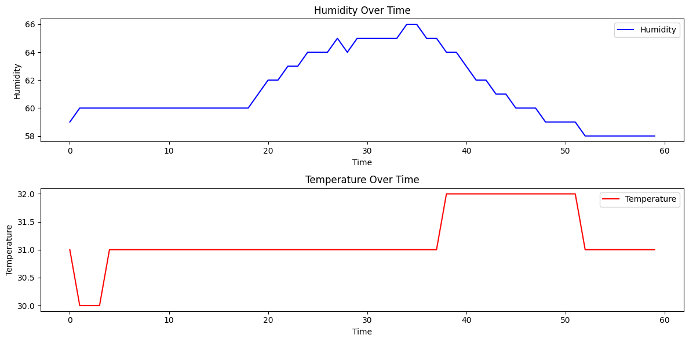

# Raspberry Pi - Assignment

## **Task:** Capture DHT11 sensor data using a Raspberry Pi and store it in a Real Time cloud database (Firebase)

### Team Members:
1. Sai Anish Sreeramagiri - SE20UARI130
2. Chaitanya Srikanth - SE20UARI038
3. Sreevaatsav Bavana -  SE20UARI147
4. Pranav Reddy - SE20UARI090
<br>

### Report:
- ```Report_RaspberryPi.pdf``` - Report for the assignment. (Download the PDF to view it)
<br>

### Codes:
1. ```capture_sensor_data.py``` - Run this python script to capture sensor readings and transfer it to a Real Time Database (Firebase).
2. ```pull_data_from_firebase.py``` - Run this python script for getting the data from the real time database to your local computer. The data is stored in a JSON file named as **"DHT_sensor_data.json"**
3. ```plot_sensor_data.ipynb``` - Run this notebook for getting the plot of the sensor data
<br>

### Components Used:
1. Raspberry Pi 3 Model B
2. DHT11 Sensor
3. Three Jumper Cables (Female to Female)
<br>

### Results - Graph Plot:

